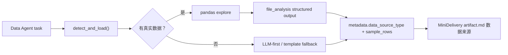

# Phase 4.4：Data Agent 真实数据源 MVP

> 状态：已完成 MVP  
> 范围：Data Agent 可读取 CSV / JSON / inline 数据，并在结果与交付物中标记数据来源。

## 一、目标

让 Data Agent 从「只写数据分析框架」升级为「能基于真实表格数据做初步分析」：

1. 用户提供 CSV / JSON 文件路径，或在 `context/input` 中传入 inline rows/data。
2. Data Agent 调用 Data Source Service 读取数据。
3. 有真实数据时走 pandas 分析路径。
4. 无真实数据时保持原有 LLM-first / template fallback 行为。
5. MiniDelivery `artifact.md` 展示数据来源和样本行数。

## 二、改动文件

| 文件 | 说明 |
| --- | --- |
| `backend/services/data_source_service.py` | 新增数据源读取服务层 |
| `agents/data_agent/agent.py` | Data Agent 接入真实数据源检测 |
| `backend/routers/minidelivery_router.py` | Data artifact 展示数据来源 |
| `tests/test_data_source_service.py` | 数据源服务与 Data Agent 路径测试 |

## 三、数据源服务设计

统一入口：

```python
from backend.services.data_source_service import detect_and_load

result = detect_and_load({
    "file_path": "sales.csv",
})
```

标准返回：

```python
DataSourceResult(
    ok=True,
    df=df,
    source_type="csv",
    row_count=100,
    col_count=5,
    columns=["date", "sales", "channel"],
    file_name="sales.csv",
)
```

## 四、支持的数据源

| 来源 | 字段 | 状态 |
| --- | --- | --- |
| CSV 文件 | `file_path` / `path` | ✅ |
| JSON 文件 | `file_path` / `path` | ✅ |
| inline JSON 字符串 | `data` / `content` / `rows` | ✅ |
| inline CSV 字符串 | `data` / `content` | ✅ |
| inline `list[dict]` | `data` / `rows` | ✅ |
| URL CSV / JSON | `url` | ✅，带 timeout 和大小限制 |
| Excel / xlsx | 原 DataAgent 路径 | 兼容保留 |

## 五、Data Agent 执行链路



## 六、MiniDelivery 展示

Data artifact 新增：

```markdown
## 数据来源

- **来源类型**: CSV 文件
- **样本行数**: 100
```

无真实数据时显示：

```markdown
- **来源类型**: 无真实数据（框架建议）
- **样本行数**: 无
```

## 七、验收结果

已验证：

- `python -c "import backend.app; print('ok')"` 通过。
- `tests/test_data_source_service.py` 通过。
- `frontend-new && npm run build` 通过。

补充边界：

- URL 读取使用 `requests.get(timeout=15)`。
- 远程响应最大限制为 `10MB`。

## 八、剩余风险

1. CSV 编码目前尝试 `utf-8` 和 `gbk`，其他编码可能失败。
2. 超大本地 CSV 未做分块读取，后续可增加 `nrows` / streaming。
3. Excel 路径仍由 DataAgent 原逻辑处理，尚未统一进 Data Source Service。
4. URL 数据源只做轻量读取，不做重试、鉴权和私有网络访问控制。
