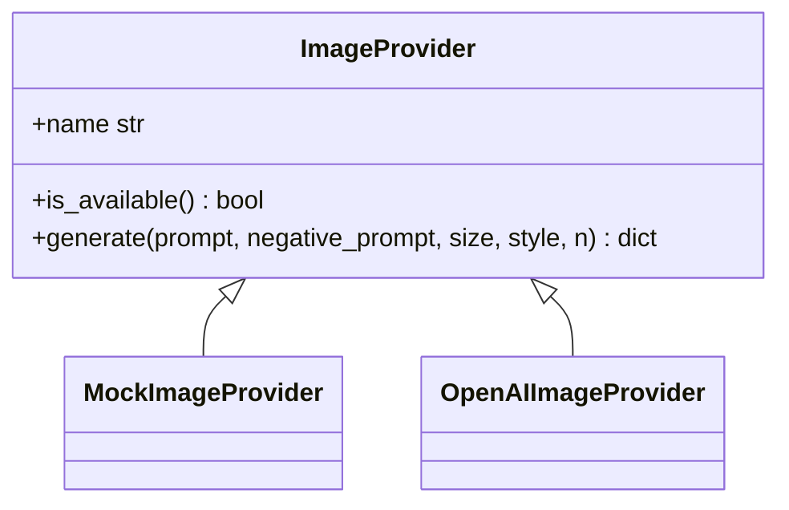

# Phase 4.8：Image Generation Provider 骨架

> 状态：已完成 Provider MVP  
> 范围：Image Agent 接入可替换图片生成 Provider，默认 mock，不强依赖真实 API key。

## 一、目标

让 Image Agent 从「只生成图片提示词」升级为「具备图片生成 Provider 接口」：

1. 保留原有图片提示词结构化输出。
2. 默认使用 `MockImageProvider` 返回占位图片。
3. 预留 `OpenAIImageProvider`，可通过 `OPENAI_API_KEY` 启用。
4. 前端 Image 页面展示 `generated_images`。
5. MiniDelivery `artifact.md` 展示生成图片、provider 和 URL。

## 二、改动文件

| 文件 | 说明 |
| --- | --- |
| `backend/services/image_generation_service.py` | 新增 Image Provider 接口、Mock、OpenAI provider |
| `agents/image_agent/agent.py` | Image Agent 接入 provider，返回 `image_provider` 和 `generated_images` |
| `backend/routers/minidelivery_router.py` | Image artifact 展示生成图片 |
| `frontend-new/src/pages/image/index.tsx` | Image 页面展示生成图片卡片 |
| `tests/test_image_generation_service.py` | Provider、Agent、artifact 测试 |

## 三、Provider 设计



工厂方法：

```python
from backend.services.image_generation_service import get_image_provider

provider = get_image_provider()
```

选择优先级：

1. 显式传入 provider 名称。
2. `IMAGE_PROVIDER` 环境变量。
3. 检测到 `OPENAI_API_KEY` 时使用 `openai`。
4. 默认回退到 `mock`。

## 四、配置

默认 mock：

```bash
IMAGE_PROVIDER=mock
```

OpenAI Images：

```bash
OPENAI_API_KEY=your_api_key
IMAGE_PROVIDER=openai
```

未配置真实 key 时不会报错，系统会使用 mock provider。

## 五、返回字段

`/agents/image/execute` 不改变请求格式，仅增量返回：

```json
{
  "metadata": {
    "image_provider": "mock"
  },
  "structured_output": {
    "image_prompt": "...",
    "generated_images": [
      {
        "url": "https://placehold.co/1024x1024/EEE/666.png?text=Mock+Image+1",
        "revised_prompt": "...",
        "size": "1024x1024",
        "index": 0,
        "is_mock": true
      }
    ]
  }
}
```

## 六、MiniDelivery 展示

Image artifact 新增：

```markdown
## 生成图片

> Provider: mock

### 图片 1 (模拟)


URL: https://placehold.co/1024x1024/EEE/666.png?text=Mock+Image+1
```

## 七、验收结果

已验证：

- `python -c "import backend.app; print('ok')"` 通过。
- `tests/test_image_generation_service.py` 通过。
- `tests/test_image_execute.py -k "not Governance"` 通过。
- `frontend-new && npm run build` 通过。

已知非本轮问题：

- `tests/test_image_execute.py` 中 2 个 Governance 旧用例失败：
  - 模糊目标未被 guard 拦截。
  - `/governance/run` 当前返回 404。

## 八、剩余风险

1. `OpenAIImageProvider` 未使用真实 API key 做端到端验收。
2. OpenAI provider 依赖 `httpx`，缺失时会返回 provider error。
3. Mock 图片是占位图，不代表真实图片生成质量。
4. 当前只接 OpenAI 预留 provider，未接 Stability / Midjourney。
